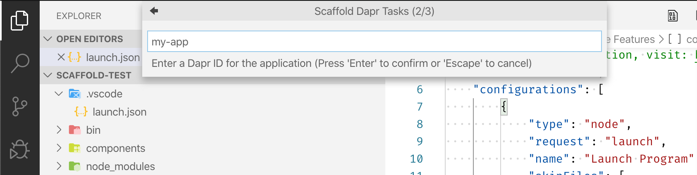
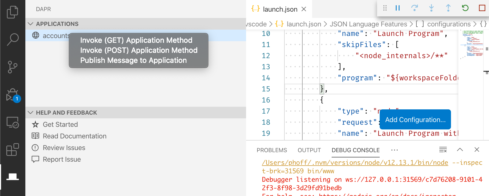
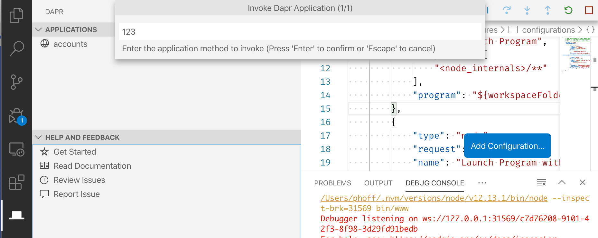
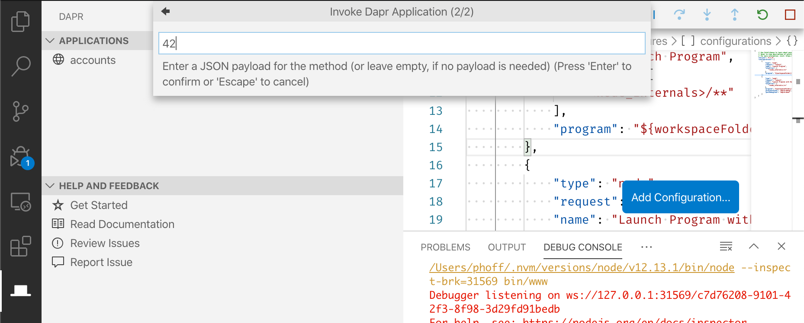
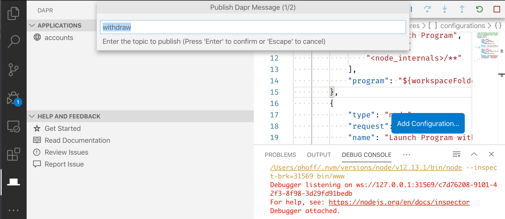

# Dapr for Visual Studio Code (Preview)

The Dapr extension makes it easy to setup debugging of applications within the Dapr environment as well as interact with applications via the Dapr runtime.

## Prerequisites

### Docker

Local development with Dapr requires a running instance of Docker; follow the [Docker guide](https://www.docker.com/products/docker-desktop) to installing Docker Desktop for your platform.

### Dapr CLI and Runtime

Follow the [Dapr guide](https://dapr.io/#download) to install the Dapr CLI for your platform and initialize the Dapr runtime.

> This extension requires Dapr version 0.10.0 or later.

### Visual Studio Code

Follow the [VS Code guide](https://code.visualstudio.com/) for installing VS Code for your platform.

> This extension requires Visual Studio Code version 1.48 or later.

## Feature Overview

### Scaffold Dapr task, launch, and component assets

While extensions for Visual Studio Code make it easy to debug applications for a variety of platforms (like .NET Core, Node.js, Python, etc.), coordinating the debugger with the Dapr runtime can be tricky. The Dapr extension helps scaffold VS Code tasks, augments debug launch configurations, and generates the Dapr component assets needed to debug your application within the Dapr environment.

### View running Dapr applications

The Dapr extension adds a new tab which shows locally-running Dapr applications and allows quickly invoking application methods or publishing events.

### Invoke Dapr application methods

When your application is running, you can quickly invoke its GET/POST methods without using a command line or switching to another HTTP request tool, including specifying an optional payload for POST methods.

### Publish events to Dapr applications

You can also use the extension to directly publish events to running applications, specifying both the topic and an optional payload.

## Telemetry

### Data Collection

The software may collect information about you and your use of the software and send it to Microsoft. Microsoft may use this information to provide services and improve our products and services. You may turn off the telemetry as described in the repository. There are also some features in the software that may enable you and Microsoft to collect data from users of your applications. If you use these features, you must comply with applicable law, including providing appropriate notices to users of your applications together with a copy of Microsoft's privacy statement. Our privacy statement is located at https://go.microsoft.com/fwlink/?LinkID=824704. You can learn more about data collection and use in the help documentation and our privacy statement. Your use of the software operates as your consent to these practices.

### Disabling Telemetry

If you don’t wish to send usage data to Microsoft, you can set the `telemetry.enableTelemetry` setting to `false`. Learn more in our [FAQ](https://code.visualstudio.com/docs/supporting/faq#_how-to-disable-telemetry-reporting).

## Microsoft Open Source Code of Conduct

This project has adopted the [Microsoft Open Source Code of Conduct](https://opensource.microsoft.com/codeofconduct/).

## License

[MIT](LICENSE.txt)
